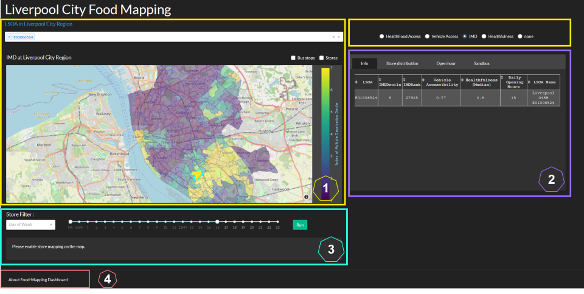

# food-mapping dashboard
Plotly App: visualisation of the food health related data in liverpool city region

Available at https://foodmapping.pythonanywhere.com/  
username: foodmapping  
password: vec

1. Choropleth map:
* LSOA dropdown menu: the choropleth map will highlight the selected regions. 
  The 'Analysis Section [2]' updates the analysis according to the select regions. 
  When 'All' is selected, the analysis is about all the available data, but choropleth 
  map will not highlight the every region for the dash response speed.
  
* Choropleth map: mapping data is controlled through radio button on the top left.
  Regions can either select directly from the map or from the dropdown menu on the top.
  
* Mapping stores and bus stops by checking the option 'Bus stops' and 'Store' on top right 
  of the map.
  
2. Analysis panel:
* 'Info' panel: list the info of the selected LSOA region.
* 'Store distribution' panel: store density at different LSOA. Y-axis can switch between
'LSOA' and 'IMD'. 'LSOA' is sorted according to the IMDRank.
* 'Open hour' panel: density map of the store opening hours.
* 'Sandbox' panel: exploring the features based on each store.The features include -- Store 
Type, LSOA, Healthfulness, Weekly Hours, Vehicle Accessibility, IMDDecile and IMDRank. 

3. Store time filter:
* Enable the option 'Store' on top right of the choropleth map. 
* Filter the opening stores according to the day of the week and the time.
* Ignore one of the condition by selecting 'NA'.

4. About Food-Mapping Dashboard:
* Interpretation of the terms used in the dashboard.

      

      
      

